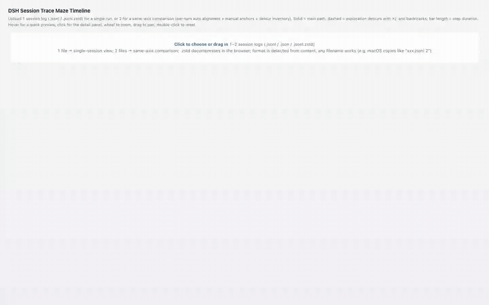

# dsh-trace-compare

[中文](README.md) | English

Trace visualization for [DeepSeek Harness](https://github.com/deepseek-ai/deepseek-harness): see how the agent actually explored — the main path it committed to, the detours that failed or dead-ended, and where it backtracked — on one shared timeline.

Two surfaces, one visual language:

- **Trace Compare** (sidebar entry): upload 1 session log for a single-run maze, or 2 logs for a same-axis comparison (e.g. flash vs pro on the same task) — answer nodes auto-align per turn, comparison anchors can be pinned by hand, and a per-turn inventory tallies the detour gap between the two runs.



- **Live Maze** (per-session conversation tab): the same maze grows in real time while the session executes; detours appear as soon as a tool result settles a step's verdict.


## What the maze shows

- Solid line: the main path — steps whose tool calls succeeded, plus answer nodes.
- **Duration capsules**: every step renders as a rounded bar spanning its start→end, verdict-colored — a 3-minute bash and a 0.2 s read are no longer the same dot; wide bars carry the duration inline.
- **Parallel tool-call rows** (since v0.3.2): when a step fires ≥2 tool calls, each call renders as a thin waterfall bar under the capsule at its real start→end, colored by its own verdict — see at a glance which of the parallel calls dragged or failed; hover a bar for that call's command/result/rationale. Lane height adapts to the maximum concurrency; detour nodes keep their "+N" label (fixed lane slots; the panel lists everything).
- Dashed arcs: exploration detours — steps whose tools failed (red ✗), searched and found nothing (gray ·), or blind-retried (gray ↻), with the return arc back to the branch point.
- **Subagent branches** (since v0.4.0, live tab): dsh subagent child sessions spawned by the model render as aggregated detour nodes branching off the main path — anchored at the spawning step on the parent's clock, with the child's judged tool calls as sub-bars; running children grow live and read "still running". Hover cards and the detail panel carry the subagent identity and spawn/rejoin copy; clicking jumps back to the spawning row. Only real task subagents qualify (`origin: 'subagent'`) — manual branch-offs and side chats stay out. Requires the host's background history-open capability; absent on the official rc line the feature hides silently.
- Hover any node or arc for a quick preview; **click** to pin a detail panel on the right — full command and result text (copy buttons; results keep their first 5000 chars), timings, verdict, reasoning summary. Close with Esc or ×.
- **Zoom navigation**: wheel zooms horizontally around the cursor, drag pans, double-click (or the fit button) resets; axis ticks re-densify with the zoom window down to 1 s.
- **Jump to conversation** (live tab only): the panel's locate button switches the host back to the Chat view and scroll-highlights the step's tool row. Rows older than the chat's loaded window degrade to the view switch alone.
- **Search & filter**: a toolbar with a failures/retries-only toggle, per-tool filtering, and full-text search over commands and results (including the 5000-char panel text); non-matching nodes and arcs fade to 15% opacity with a live hit count. Filter state survives live-mode rebuilds.
- **Turn alignment lines** (two-session compare, since v0.3.0): each turn's answer nodes are auto-connected with a comparison line labeled with both wall-clock arrival times, the delta, and that turn's detour counts (e.g. "Turn 3 answer: 1st 4m ↔ 2nd 6m (Δ2m) · detours 4↔0"). Only turns present in both runs get a line — the old corpus-specific "model list result" regex milestone is retired.
- **Manual anchors** (two-session compare): after "🔗 add anchor", click one node in each lane to pin a comparison line with its time delta; click the line to delete, Esc cancels picking. Useful for pinning semantically equivalent moments that sit in different turns.
- **Detour inventory** (two-session compare): "📋 detour inventory" opens a per-turn table — each side's detour step count, wall-clock time, verdict breakdown (✗ failure / ↻ blind retry / · dead end) and the verdict-time gap (e.g. "session 2 wasted 48.4s more"); clicking a row zooms to that turn and keeps only its detours visible. A turn present on one side only shows "—" — the absence itself is signal.
- **Export**: one click saves the current view (zoom window and filter dimming included) as SVG or 2x PNG with styles inlined; **exports are always light-background** regardless of the page's current theme (built for sharing).
- **Theme following** (since v0.3.1): the page tracks the host dsh light/dark theme (the host components watch `body[data-ds-dark-theme]` and postMessage into the iframe); standalone opens follow the system preference.
- **Compact header** (since v0.3.1): once data renders, the intro text hides, the upload zone collapses to a slim strip, the per-lane stat cards hide (the same info lives in the lane bands), and the legend fits one row — the maze gets nearly the whole viewport.
- Playback replays the whole run at up to 300×.

Timeline honesty rules:

- **Idle folding**: stretches with no step or tool activity for over 60 s (you thinking between turns) collapse into a thin `⏸` seam labeled with the skipped duration. Axis ticks keep wall-clock labels inside activity segments.
- Step identity is turn-qualified (`S15·47`), so multi-turn sessions attach detours to the right nodes.
- Durations, tool timings, and totals stay wall-clock; only the axis is compressed.
- **The live tab renders only the conversation's loaded event window** (honestly labeled since v0.2.3): stale steps from earlier turns leaking into the window edge are dropped and noted as "⏮ N earlier steps not loaded" instead of piling at 0 s and inflating stats; for the whole session, download the log and use the upload view.
- **Tokens are real** (since v0.2.2): reasoning/output tokens come from the session log's `assistant/message` `usage` (the old "reasoning N tok" counted streaming chunks, not tokens). Logs without usage fall back to an honest "N reasoning segments" label.

Verdict honesty rules (since v0.2.1):

- **No output-length verdicts.** Per-tool verdicts layer: error flag (isError) → failure signatures → per-tool-class rules (write tools succeed unless errored; search tools only dead-end on empty results; bash and unknown tools succeed with any output).
- **Failure signatures scan only the head and tail windows** (since v0.2.3): real errors either lead the output or sit in the appended stderr section, while error-looking text QUOTED mid-output (git log, file reads, log dumps) is deliberately ignored — a command that prints "upstream returns HTTP 400" inside a commit message did not itself fail. Both render paths judge the same untruncated text.
- **Blind retries** are behavioral: only consecutive same-tool, similar-args call clusters containing at least one failure are marked — following AgentLens-style deterministic waste detection for SWE-agent trajectories.
- Every verdict carries a **rationale string**, visible in the hover tooltip and the detail panel.
- All thresholds and tool classes live in `VERDICT_RULES` in `src/client/verdict.js`, tunable per corpus; the upload page and the live tab share this single implementation (spliced in at build time).

## Session log support

Upload accepts DSH session logs in any of these forms, detected by content (the file name does not matter — macOS duplicates like `session.jsonl 2` work):

- plain `.jsonl` (session format v0 event streams)
- `.jsonl.zstd` exactly as stored under `~/.dsh/sessions/` — decompressed in the browser (native `DecompressionStream('zstd')` when available, bundled [fzstd](https://github.com/101arrowz/fzstd) otherwise)

## Install

Install the compatible DSH CLI, then add the plugin to the profile:

```sh
npm install --global @deepseek-ai/dsh@0.1.0-rc.6
dsh plugin --profile web add https://github.com/lamost423/dsh-trace-compare/releases/download/v0.4.0/dsh-trace-compare-0.4.0.tgz
dsh web
```

To install from a checkout instead:

```sh
git clone https://github.com/lamost423/dsh-trace-compare.git
cd dsh-trace-compare
corepack enable
pnpm install
pnpm build
dsh plugin --profile web add .
dsh web
```

After a restart of `dsh web`, the sidebar footer gains a **Trace Compare** entry and every session view gains a **Live Maze** tab.

## Recent iterations

### Current branch-verdict logic (introduced v0.2.1, refined v0.2.3)

Whether a step stays on the main path or becomes a branch is decided by its worst tool verdict: ok/answer stay on the trunk; failure (red x), empty-handed search (gray dot), and blind retry (gray loop) move the whole step to a branch. Each tool call is judged in four layers:

1. **Error flag**: the result carries isError → failure;
2. **Strong failure signatures**: wrapper hard markers like `[status=Failed]`, non-zero `__EXIT__=`, `[stderr]` followed by Error/Traceback → failure. Scanned only in the first 300 and last 1000 chars — real failures either lead the output or sit in the appended stderr section; errors QUOTED mid-output (git log messages, source strings) don't count;
3. **Weak failure signatures**: Traceback, command not found, Permission denied, No such file, HTTP 4xx/5xx, leading Error: → failure, first 300 chars only;
4. **Per-tool-class rules**: write tools (write / edit / todo_write) succeed unless errored, regardless of output length; search tools (grep / read / web_search) only dead-end when the head matches a no-result signature; bash and unknown tools only dead-end on empty output.

On top sits a **behavioral layer**: consecutive same-tool calls with args similarity >= 0.6 forming a cluster that contains at least one failure mark their non-failing members as blind retries (AgentLens-style deterministic waste detection; without the failure constraint, ordinary consecutive edits to one file would be misflagged). Deliberately no output-length rules and no LLM calls; every verdict carries a rationale string visible in tooltips and the detail panel. All thresholds live in `VERDICT_RULES` in `src/client/verdict.js`, tunable per corpus; the upload page and the live tab share this single implementation. Calibrated on four real sessions (871 steps total) — evidence and false-positive cases in the version notes below.

### v0.4.0 - Subagent execution folds into the live maze (2026-08-20)

Tasks the model spawns through the `subagent` tool used to be one opaque bar; now every dsh subagent child session folds into the parent's live maze as an aggregated detour node — anchored at the spawning main-path step on the shared clock, with the child's judged tool calls (args/results/verdicts) as sub-bars, live growth while running, and a click-through back to the spawning row. Admission is disciplined: only `origin: 'subagent'`, non-ephemeral children (manual "branch in new conversation" and side chats stay out), and settled children whose whole activity predates the visible window are dropped under the parent's pre-window rule. Subagent identity runs through node labels, hover cards, and the detail panel ("⤴ spawned from main step SN; results rejoin the main path"), replacing the dead-end copy that belongs to failed exploration; internal step ids are no longer user-visible. Requires the host's `SessionFace.open` background history capability — absent through official rc.6–rc.8 the feature degrades silently, everything else unaffected. [Release](https://github.com/lamost423/dsh-trace-compare/releases/tag/v0.4.0)


### v0.3.3 - Fix: live maze went blank at the start of every new step (2026-08-19)

Whenever a new step began in the live tab (model reasoning, no tool call issued yet), the whole maze turned transparent until the first tool call appeared. Root cause was a tier-1-era bug: the node label code read `tools[0].name` unguarded, and an in-flight step has an empty `tools` array during its reasoning phase — the TypeError aborted build() mid-way, leaving every element at its initial opacity 0. Zero-tool nodes now skip the tool label; verified with a synthetic push sequence (reasoning phase → tool appears → settled) staying visible throughout. [Release](https://github.com/lamost423/dsh-trace-compare/releases/tag/v0.3.3)

### v0.3.2 - Parallel tool-call rows (2026-08-19)

Multiple tool calls in one step used to collapse into a "bash +1" label, hiding each call's timing and verdict. Now every call renders as a thin waterfall bar under the step capsule at its real start→end, verdict-colored, with a per-call hover (command / result / rationale); lane height adapts to the lane's maximum concurrency (parH zone in computeLayout) and detour arcs shift below it. Real-corpus scale: the 16-turn session has 36 parallel steps, max concurrency 5. [Release](https://github.com/lamost423/dsh-trace-compare/releases/tag/v0.3.2)


### v0.3.1 - Theme following + compact header (2026-08-19)

The palette collapses into CSS variables as the single source (SVG attribute colors read via `readPalette`), tracking the host dsh theme: host components watch `body[data-ds-dark-theme]` (rc.6's ThemePresenter mechanism) and postMessage into the sandboxed iframe; standalone opens fall back to the system preference. Exports stay light-background — under dark the page briefly rebuilds in light, serializes, and switches back. The same release compacts the header once data renders (intro hidden, upload zone down to a 31px strip, stat cards hidden, one-row legend), freeing ~250px for the maze, and bumps the blind-retry gray from #b6c0d2 to #8892a6 for legibility. [Release](https://github.com/lamost423/dsh-trace-compare/releases/tag/v0.3.1)


### v0.3.0 - Compare semantics: turn alignment + manual anchors + detour inventory (2026-08-19)

Two-session comparison graduates from a single regex milestone to per-turn semantics: answer nodes auto-connect per turn (labeled with the time delta and detour counts); manual anchors pin any two nodes; the detour inventory tallies per-turn detour steps, wall-clock time, and verdict breakdown for both sides, with row-click zoom and highlighting. The corpus-specific "model list result" regex milestone (MODEL_LIKE/mlist) is retired — the last hardcoded heuristic left after verdict v2 removed the length thresholds. The "exploration phase" red band is retired too: it spanned min-to-max across all detours, covering 99% of a 16-turn session's axis while actual detour time was 1% — a false signal. [Release](https://github.com/lamost423/dsh-trace-compare/releases/tag/v0.3.0)


### v0.2.3 - Honest live window + quote-proof verdicts (2026-08-19)

The live tab renders only the conversation's loaded event window — stale steps from earlier turns leaking past the window edge used to clamp to 0 s and pile up on the left, rendering an 18-hour, 533-step session as "3 turns / 39 steps / 71.4 s". They are now dropped and labeled "N earlier steps not loaded". Also fixed quoted-error false positives: "upstream returns HTTP 400" inside a git commit message no longer flags the command itself — failure signatures scan only the head and tail windows, and both render paths judge the same untruncated text. [Release](https://github.com/lamost423/dsh-trace-compare/releases/tag/v0.2.3)


### v0.2.2 - Real tokens, search & filter, export (2026-08-19)

"reasoning N tok" used to count streaming chunks — now real usage is read from the session log's `assistant/message` events, per step and per lane (honest "N segments" fallback without usage). Added the filter toolbar (failures/retries-only, per-tool, full-text search with 15% dimming of misses) and current-view SVG / 2x PNG export. [Release](https://github.com/lamost423/dsh-trace-compare/releases/tag/v0.2.2)


### v0.2.1 - Explainable verdicts: no more length thresholds (2026-08-19)

"Result < 60 chars = dead end" retired in favor of the layered verdicts + behavioral retry detection described above. Motivation: calibration showed the length threshold misjudged 56 of 338 tool calls (every 57-char todo_write confirmation included) while missing real failures buried in long outputs. Verdict logic also converged into the single source `src/client/verdict.js` (spliced into the upload page at build time, imported by the live path), ending mirror drift for good. [Release](https://github.com/lamost423/dsh-trace-compare/releases/tag/v0.2.1)

## Development

```sh
pnpm install
pnpm check   # typecheck + vitest + build
```

The upload/visualization page is a self-contained HTML document (`src/client/maze-upload.html`) rendered inside a sandboxed `<iframe srcDoc>`; parsing and rendering run entirely in the browser, and nothing from an uploaded log reaches the host.

## License

MIT. See [NOTICE](NOTICE) — this project contains code derived from DeepSeek Harness.
