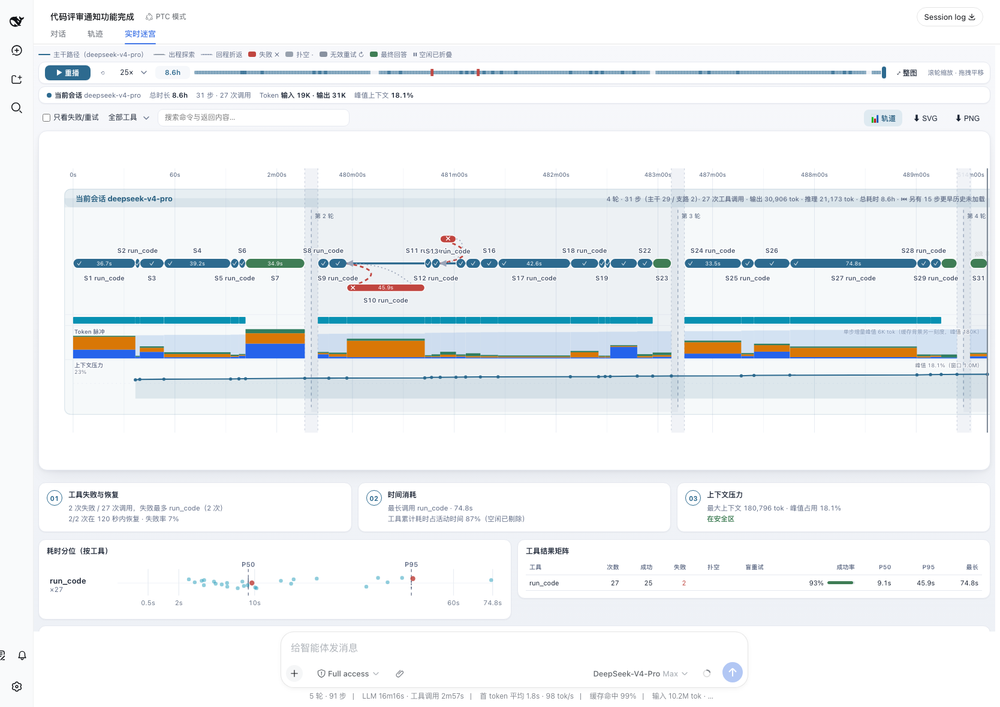
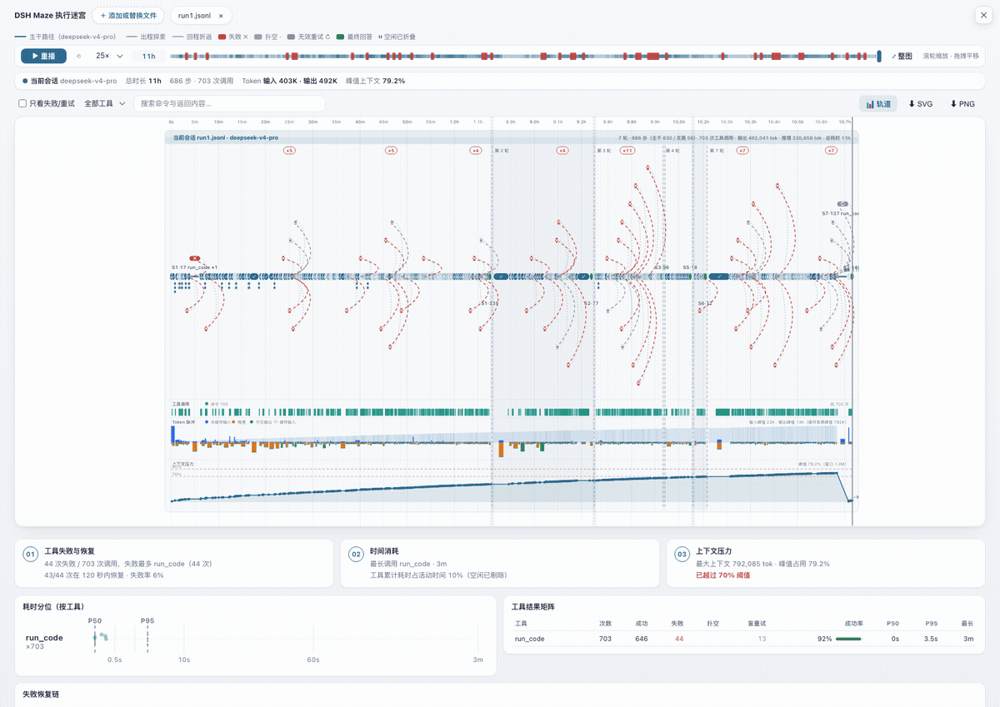
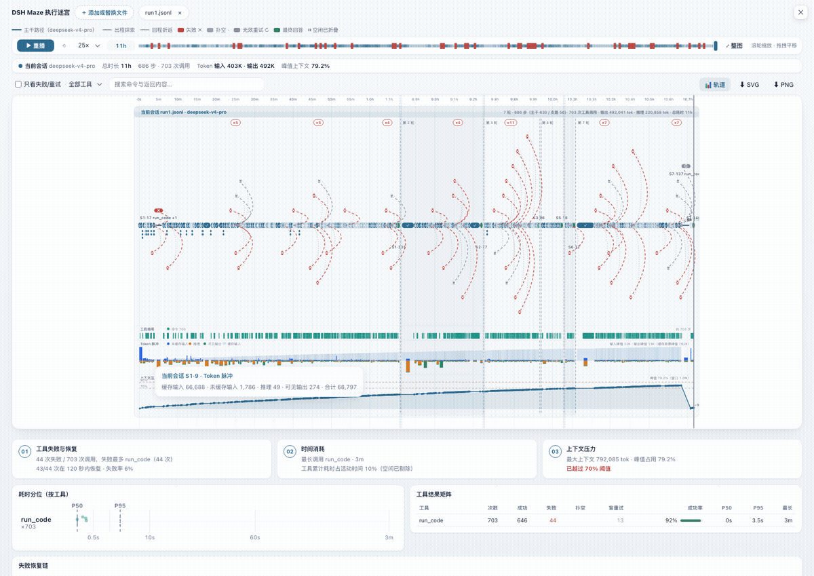
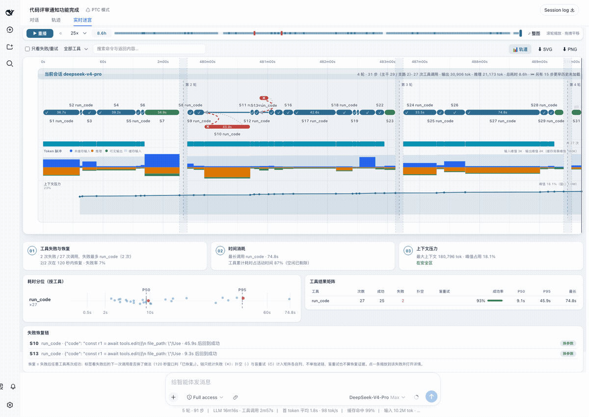
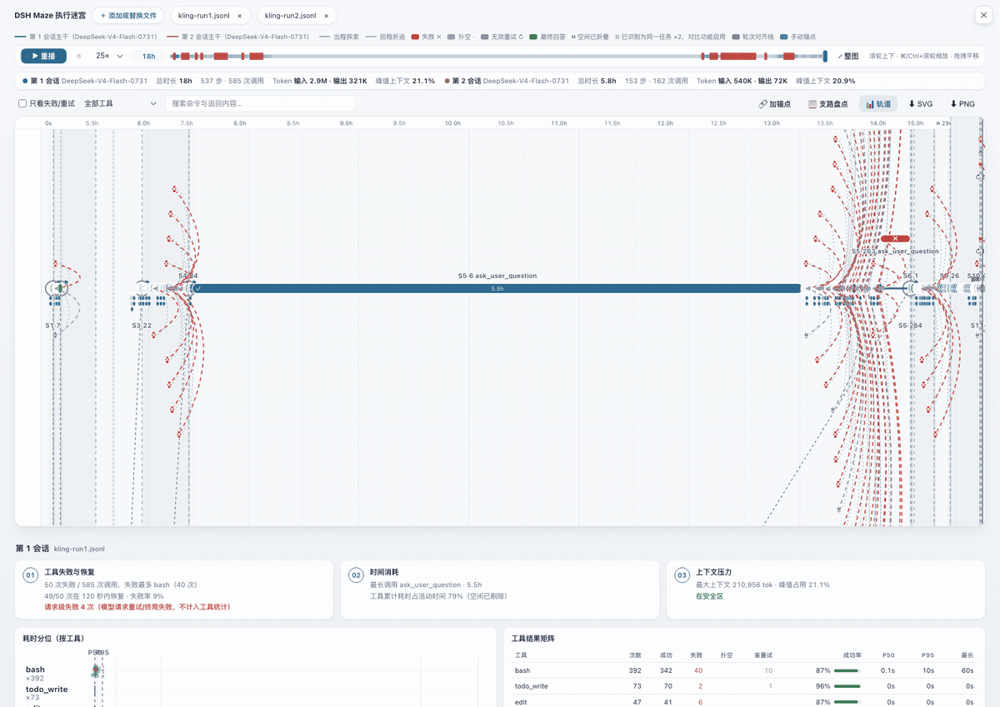
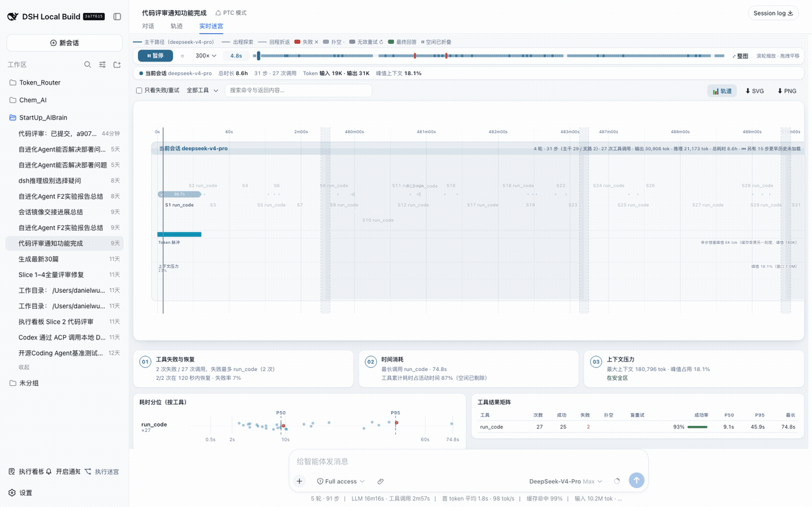

# dsh-maze

> 🔀 **`dsh-trace-compare` is now `dsh-maze`** (since v1.0.0). The old package stays installable but frozen — [migration is two commands](#migrating-from-dsh-trace-compare).

[中文](README.md) | English

[](https://www.npmjs.com/package/dsh-maze)
[](https://www.dsh.so/artifact/dsh-trace-compare)
[](https://www.dsh.so/artifact/dsh-trace-compare)
[](https://github.com/bruc3van/awesome-dsh-plugin)
[](https://github.com/awesome-dsh-plugin/awesome-dsh-plugin)
[](https://dshbase.com/plugins/dsh-maze/)
[](https://github.com/Dominic789654/awesome-deepseek-harness)
[](https://github.com/0xsline/awesome-deepseek-harness)

[](https://github.com/XingLingQAQ/dsh-plugin-registry)
[](https://dshfind.com/zh/plugins/lamost423/dsh-maze?ref=badge)
[](https://github.com/unStone/dsh-xray)
[](https://whyihaveyou.github.io/dsh-suite/)

<sub>Also listed in: [fendouai/awesome-deepseek-harness](https://github.com/fendouai/awesome-deepseek-harness) (dedicated intro page)· [Zhiyuan-Fan/Awesome-DeepSeek-Harness-Plugins](https://github.com/Zhiyuan-Fan/Awesome-DeepSeek-Harness-Plugins) · [ZeroPointRepo/awesome-dsh-plugins](https://github.com/ZeroPointRepo/awesome-dsh-plugins) · [cccakeee/awesome-dsh-plugins](https://github.com/cccakeee/awesome-dsh-plugins)</sub>

The **execution maze** for [DeepSeek Harness](https://github.com/deepseek-ai/deepseek-harness) agents: see how the agent actually worked — drawn in full, and analyzed.



- **The maze** — main path, failed detours and backtracks on one timeline; idle stretches fold away, dense segments cluster into "×N" badges (click to zoom, labels refill progressively), and the seek bar carries a failure heatmap. An 8-hour session stays legible:



- **Data tracks** — per-step tool-call density, token pulse (cache backdrop + uncached-input/reasoning/output bars), and context pressure (70%/90% threshold lines, compaction events marked "⌄−N%" with before/after on hover):



- **Execution analysis** — failure recovery chains (identical retry / changed args / switched tool / not recovered), a per-tool result matrix, duration percentile scatter. **Every conclusion is one click away from its evidence**:



- **Multi-session comparison** — 2–5 runs of the same task on one axis: turn alignment, manual anchors, detour inventory.



- **Replay** — up to 300× playback of the whole run:



**House rules**: every number is a deterministic aggregation over judged data — no LLM involved; every verdict carries its rationale and every conclusion traces back to evidence; missing data is labeled honestly (no tracks without usage, no guessed context windows), never invented.

Two entries: the **Live Maze** tab inside every session (grows with the running session), and **Maze** in the sidebar (upload session logs to inspect or compare).

## What the maze shows

- Solid line: the main path — steps whose tool calls succeeded, plus answer nodes.
- **Duration capsules**: every step renders as a rounded bar spanning its start→end, verdict-colored — a 3-minute bash and a 0.2 s read are no longer the same dot; wide bars carry the duration inline.
- **Parallel tool-call rows** (since v0.3.2): when a step fires ≥2 tool calls, each call renders as a thin waterfall bar under the capsule at its real start→end, colored by its own verdict — see at a glance which of the parallel calls dragged or failed; hover a bar for that call's command/result/rationale. Lane height adapts to the maximum concurrency; detour nodes keep their "+N" label (fixed lane slots; the panel lists everything).
- Dashed arcs: exploration detours — steps whose tools failed (red ✗), searched and found nothing (gray ·), or blind-retried (gray ↻), with the return arc back to the branch point.
- **Subagent branches** (since v0.4.0, live tab): dsh subagent child sessions spawned by the model render as aggregated detour nodes branching off the main path — anchored at the spawning step on the parent's clock, with the child's judged tool calls as sub-bars; running children grow live and read "still running". Hover cards and the detail panel carry the subagent identity and spawn/rejoin copy; clicking jumps back to the spawning row. Only real task subagents qualify (`origin: 'subagent'`) — manual branch-offs and side chats stay out. Requires the host's background history-open capability; absent on the official rc line the feature hides silently.
- Hover any node or arc for a quick preview; **click** to pin a detail panel on the right — full command and result text (copy buttons; results keep their first 5000 chars), timings, verdict, reasoning summary. Close with Esc or ×.
- **Zoom navigation**: wheel zooms horizontally around the cursor, drag pans, double-click (or the fit button) resets; axis ticks re-densify with the zoom window down to 1 s.
- **Jump to conversation** (live tab only): the panel's locate button switches the host back to the Chat view and scroll-highlights the step's tool row. Rows older than the chat's loaded window degrade to the view switch alone.
- **Search & filter**: a toolbar with a failures/retries-only toggle, per-tool filtering, and full-text search over commands and results (including the 5000-char panel text); non-matching nodes and arcs fade to 15% opacity with a live hit count. Filter state survives live-mode rebuilds.
- **Turn alignment lines** (same-task compare kit, since v0.3.0, now up to 5 lanes): enabled only when the files are recognized as runs of one task (identical first user message). Each turn's answer nodes connect into a cross-lane chain labeled with every lane's per-turn time (turn start → answer done; inter-turn waits for user input are excluded, since v0.5.1); with exactly two lanes the label adds the delta and that turn's detour counts (e.g. "Turn 3 time: 1st 4m ↔ 2nd 6m (Δ2m) · detours 4↔0"). Only turns present in ≥2 lanes get a line — the old corpus-specific "model list result" regex milestone is retired.
- **Manual anchors** (same-task compare kit): after "🔗 add anchor", click one node in each of any two lanes to pin a comparison line with its time delta; click the line to delete, Esc cancels picking. Useful for pinning semantically equivalent moments that sit in different turns.
- **Detour inventory** (same-task compare kit): "📋 detour inventory" opens a per-turn table — every lane's detour step count, wall-clock time, and verdict breakdown (✗ failure / ↻ blind retry / · dead end), with a delta column at exactly two lanes (e.g. "session 2 wasted 48.4s more"); clicking a row zooms to that turn and keeps only its detours visible. A lane missing that turn shows "—" — the absence itself is signal. Files that are different tasks render side-by-side only, and none of these three appear (the legend says why).
- **Lane data tracks** (v0.7, 📊 toggleable): three tracks under each lane band sharing the maze's time axis — **tool-call density** (one tick per call, colored by read/search/shell/edit/other), **token pulse** (per-step stacked bars: cached input / uncached input / reasoning / visible output, read from real usage), and **context pressure** (line+area with a data-adaptive y-axis; with a known model window it shows percentage plus 70%/90% threshold lines and compaction appears as sawtooth drops; an unknown or stale window falls back to absolute tokens — never a >100% reading). Tracks with no usage in the log are not drawn and take no height.
- **Execution analysis section** (v0.7, rendered right below the maze in the main view): three summary cards (tool failures & recovery / time spent / context pressure), a **duration scatter plot** (one row per tool, global P50/P95 reference lines, failed calls highlighted, hover for the individual call), a per-tool result matrix (ok/failed/no-result/blind-retry/success rate plus P50/P95/max durations), and **failure recovery chains** — what happened after each failed call: identical retry / changed args / switched tool / not recovered, with honest recovery times; click a row to zoom to that failure and open its details. Scope note: chains cover failures (✗) only — no-result (·) and blind-retry (↻) calls count in their own matrix columns, not in the chains, and a blind retry never counts as recovery evidence. Every number is a deterministic aggregation — no LLM involved.
- **Agent graph** (v0.7, a block inside the analysis section): a star overview of the main agent and its subagents — node size = tokens consumed per agent, edge width = tool-call count, running subagents dashed; click a subagent node to jump to its span on the timeline. Appears only when subagent data exists.
- **Export**: one click saves the current view (zoom window and filter dimming included) as SVG or 2x PNG with styles inlined; **exports are always light-background** regardless of the page's current theme (built for sharing).
- **Bilingual UI** (since v0.5.0): the whole page (upload area, legend, lane stats, alignment lines, detour inventory, hover cards, detail panel, errors) ships in Chinese and English, live-follows the dsh host's language setting when embedded, and falls back to the browser language when opened standalone; verdict rationales are structured keys rendered in the current language, so switching languages needs no re-upload.
- **Theme following** (since v0.3.1): the page tracks the host dsh light/dark theme (the host components watch `body[data-ds-dark-theme]` and postMessage into the iframe); standalone opens follow the system preference.
- **Settings toggle** (since v2.1.0): "Settings → Maze" can hide the sidebar entry — live-tab-only users can drop the persistent button; the flip applies immediately with no reload, persists per browser, and never affects the Live Maze tab or an open maze page.
- **Compact header** (since v0.3.1): once data renders, the intro text hides, the upload zone collapses to a slim strip, the per-lane stat cards hide (the same info lives in the lane bands), and the legend fits one row — the maze gets nearly the whole viewport.
- Playback replays the whole run at up to 300×.

Timeline honesty rules:

- **Idle folding**: stretches with no step or tool activity for over 60 s (you thinking between turns) collapse into a thin `⏸` seam labeled with the skipped duration. Axis ticks keep wall-clock labels inside activity segments.
- Step identity is turn-qualified (`S15·47`), so multi-turn sessions attach detours to the right nodes.
- Durations, tool timings, and totals stay wall-clock; only the axis is compressed.
- **The live tab renders only the conversation's loaded event window** (honestly labeled since v0.2.3): stale steps from earlier turns leaking into the window edge are dropped and noted as "⏮ N earlier steps not loaded" instead of piling at 0 s and inflating stats; for the whole session, download the log and use the upload view.
- **Tokens are real** (since v0.2.2): reasoning/output tokens come from the session log's `assistant/message` `usage` (the old "reasoning N tok" counted streaming chunks, not tokens). Logs without usage fall back to an honest, self-explaining "reasoning N chunks (no token usage in log)" label — relay logs often omit reasoning-token fields, and side by side with official-API logs the differing units used to confuse (since v0.5.1).

Verdict honesty rules (since v0.2.1):

- **No output-length verdicts.** Per-tool verdicts layer: error flag (isError) → failure signatures → per-tool-class rules (write tools succeed unless errored; search tools only dead-end on empty results; bash and unknown tools succeed with any output).
- **Failure signatures scan only the head and tail windows** (since v0.2.3): real errors either lead the output or sit in the appended stderr section, while error-looking text QUOTED mid-output (git log, file reads, log dumps) is deliberately ignored — a command that prints "upstream returns HTTP 400" inside a commit message did not itself fail. Both render paths judge the same untruncated text.
- **Blind retries** are behavioral: only consecutive same-tool, similar-args call clusters containing at least one failure are marked — following AgentLens-style deterministic waste detection for SWE-agent trajectories.
- Every verdict carries a **rationale string**, visible in the hover tooltip and the detail panel.
- All thresholds and tool classes live in `VERDICT_RULES` in `src/client/verdict.js`, tunable per corpus; the upload page and the live tab share this single implementation (spliced in at build time).

## Session log support

Upload accepts DSH session logs in any of these forms, detected by content (the file name does not matter — macOS duplicates like `session.jsonl 2` work):

- plain `.jsonl` (session format v0 event streams)
- `.jsonl.zstd` exactly as stored under `~/.dsh/sessions/` — decompressed in the browser (native `DecompressionStream('zstd')` when available, bundled [fzstd](https://github.com/101arrowz/fzstd) otherwise)

## Install

**Check where your host came from first.** Host `0.1.2` re-split its client packages (`dsh-client-runtime` became `dsh-client-store` and friends) and swapped the conversation snapshot model, so the two lines are not interchangeable:

| Your host | Version to install | Command |
|---|---|---|
| The `0.1.2` line — DSH Desktop 2.x, npm's `@deepseek-ai/dsh@next` (`0.1.2-rc.1`), or self-built master | dsh-maze `2.x`, tag `latest` | `dsh plugin --profile web add dsh-maze` |
| Older hosts — npm `latest` (`0.1.0-rc.6` ~ `0.1.1-rc.2`) | dsh-maze `1.1.0`, pinned manually | `dsh plugin --profile web add dsh-maze@1.1.0` |

Host `0.1.2-rc.1` and its split-out client packages are on npm now (tag `next`), so as of v2.0.0 `latest` belongs to `2.x`; anyone still on an older host just pins `1.1.0`. Once the host's own `latest` moves to `0.1.2`, this table collapses to one row.

Compatibility: `2.0.0` builds against the npm `0.1.2-rc.1` package set, with typecheck and all 49 tests green; live acceptance was done as `2.0.0-alpha.2` × upstream master `0.1.2-alpha.1` — installed from npm, driven through a real session, with every on-screen number reconciled against the host's own accounting. `1.1.x` is verified against official `0.1.0-rc.6` (build + full tests) and `rc.8` (slot/type audit + live acceptance).

```sh
npm install --global @deepseek-ai/dsh@next
dsh plugin --profile web add dsh-maze
dsh web
```

After restarting `dsh web`, the sidebar gains a **Maze** entry and every session view gains a **Live Maze** tab.

From source:

```sh
git clone https://github.com/lamost423/dsh-maze.git
cd dsh-maze
corepack enable && pnpm install && pnpm build
dsh plugin --profile web add .
dsh web
```

## Migrating from dsh-trace-compare

```sh
dsh plugin --profile web remove dsh-trace-compare
dsh plugin --profile web add dsh-maze
```

The old package is frozen at v0.7.0 (feature-identical to dsh-maze 1.0.0); only dsh-maze moves forward. The old GitHub URL redirects here.

## Version history

See [CHANGELOG.md](CHANGELOG.md).

## Development

```sh
pnpm install
pnpm check   # typecheck + vitest + build
```

The upload/visualization page is a self-contained HTML document (`src/client/maze-upload.html`) rendered inside a sandboxed `<iframe srcDoc>`; parsing and rendering run entirely in the browser, and nothing from an uploaded log reaches the host.

## License

MIT. See [NOTICE](NOTICE) — this project contains code derived from DeepSeek Harness.
