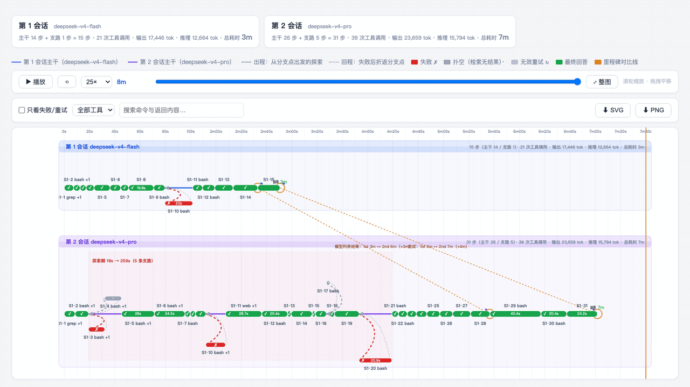

# dsh-trace-compare

中文 | [English](README.en.md)

[](https://www.npmjs.com/package/dsh-trace-compare)
[](https://github.com/bruc3van/awesome-dsh-plugin)
[](https://github.com/awesome-dsh-plugin/awesome-dsh-plugin)
[](https://dshbase.com/plugins/dsh-trace-compare/)
[](https://github.com/Dominic789654/awesome-deepseek-harness)
[](https://github.com/0xsline/awesome-deepseek-harness)

[](https://github.com/XingLingQAQ/dsh-plugin-registry)
[](https://dshfind.com/zh/plugins/lamost423/dsh-trace-compare?ref=badge)
[](https://github.com/unStone/dsh-xray)
[](https://whyihaveyou.github.io/dsh-suite/)

<sub>还被收录于：[fendouai/awesome-deepseek-harness](https://github.com/fendouai/awesome-deepseek-harness)（独立介绍页）· [Zhiyuan-Fan/Awesome-DeepSeek-Harness-Plugins](https://github.com/Zhiyuan-Fan/Awesome-DeepSeek-Harness-Plugins) · [ZeroPointRepo/awesome-dsh-plugins](https://github.com/ZeroPointRepo/awesome-dsh-plugins) · [cccakeee/awesome-dsh-plugins](https://github.com/cccakeee/awesome-dsh-plugins)</sub>

[DeepSeek Harness](https://github.com/deepseek-ai/deepseek-harness) 的执行轨迹可视化插件：把智能体真实的探索过程画出来——它坚持推进的主干、失败或扑空的支路、以及折返点，全部落在同一根时间轴上。

两个入口，一套视觉语言：

- **Trace 对比**（侧边栏入口）：上传 1 个 session log 看单次运行的迷宫，或上传 2~5 个做同轴对比（比如同一任务在 flash 与 pro 上的跑法差异）。页面按首条用户消息识别「是不是同一任务的多次跑」：同任务启用对比件——按轮次自动对齐各泳道的回答节点（跨泳道连线）、任意两条泳道之间可手动钉锚点、按轮次盘点各泳道支路（双泳道时附差额列）；任务不同则仅同轴并排。



- **实时迷宫**（会话内页签）：同一张迷宫图随当前会话执行实时生长；某一步的工具结果一旦落定，支路立刻显现。


长会话也照样读得清——14 小时、8.6MB 的日志，字字可辨，⌘/Ctrl+滚轮扎进任意一段：


## 迷宫画的是什么

- 实线：主干路径——工具调用成功推进的步骤和回答节点。
- **时长胶囊条**：每个步骤画成从开始到结束的圆角条，判定色填充——3 分钟的 bash 和 0.2 秒的 read 一眼可辨；条够宽时耗时直接写在条内。
- **并行工具分行**（v0.3.2 起）：一步内 ≥2 次工具调用时，每次调用画成胶囊条下方的细小条（瀑布惯例），按各自真实起止摆位、按各自判定上色——一眼看出并行发的几个调用里哪个拖了时间、哪个失败；悬停单条看该次调用的命令/返回/判定依据，泳道高度随最大并行数自适应。支路节点保持「+N」标签（其空间为固定泳道格，详情面板已列全）。
- 虚线弧：探索支路——工具失败（红 ✗）、检索扑空（灰 ·）或盲目重试（灰 ↻）的步骤，以及折返回分支点的回程线。
- **子代理支路**（v0.4.0 起，实时页签）：模型派生的 dsh 子代理会话画成主干上分出的聚合支路节点——挂靠在派生它的那一步、与父会话共享时间轴，节点子条是子代理全部已判定的工具调用，运行中的子代理实时生长并标注「仍在运行」；悬停/详情面板显示「子代理支路」身份与派生汇回关系，点击跳回主对话中的派生位置。只认真正的任务子代理（`origin: 'subagent'`），手动分支和 side-chat 侧聊不入图。依赖宿主「后台加载子会话历史」的能力，官方 rc 线暂缺该能力时自动静默隐藏。
- 悬停任意节点或弧线快速预览；**点击**在右侧打开固定详情面板——完整命令与返回内容（各带复制按钮，返回内容保留前 5000 字）、耗时、判定、思考摘要，Esc 或 × 关闭。
- **缩放导航**：滚轮以光标为中心横向缩放，拖拽平移，双击空白处或「⤢ 整图」按钮复位；轴刻度随缩放窗口自动加密（最细到 1 秒）。
- **跳转对话**（仅实时页签）：详情面板里点「在对话中定位此步骤」，宿主切回对话页并滚动高亮对应的工具行。行太老、超出对话已加载窗口时退化为只切页签。
- **搜索与过滤**：工具行提供「只看失败/重试」开关、按工具类型过滤、命令与返回内容全文搜索（含 5000 字面板全文）；不命中的节点与支路淡化到 15% 透明度，实时显示命中步数。实时模式下过滤状态在重建后自动还原。
- **轮次对齐线**（双会话对比，v0.3.0 起）：每一轮的回答节点自动互连一条对比线，标注两边**本轮各自的耗时**（该轮起点 → 回答完成；轮与轮之间等用户输入的空闲不计入，v0.5.1 起）、耗时差和该轮支路数差（如「第 3 轮耗时：1st 4m ↔ 2nd 6m（Δ2m）· 支路 4↔0」）。只连两边都有的轮次——旧版从特定任务总结的「模型列表结果」正则里程碑已退役。
- **手动锚点**（双会话对比）：「🔗 加锚点」后在两条泳道各点一个节点，钉一条带时差标注的对比线；点线删除，Esc 取消选点。适合钉住两边语义等价但轮次错位的时刻。
- **支路盘点**（双会话对比）：「📋 支路盘点」打开按轮次的差额表——每轮两边各自的支路步数、墙钟耗时、类别构成（✗ 失败 / ↻ 无效重试 / · 扑空）和差额结论（如「第 2 会话多耗 48.4s」）；点一行缩放到该轮并只保留该轮支路，其余淡化。一边有这轮另一边没有显示「—」，缺席本身就是信号。
- **泳道数据轨道**（v0.7 起，📊 可开关）：泳道带底部三条与迷宫同一时间轴联动的轨道——**工具调用密度**（每次调用一根刻线，按读取/检索/命令/编辑/其他着色）、**Token 脉冲**（每步堆叠柱：缓存输入/未缓存输入/推理/可见输出，读自 usage 真值）、**上下文压力**（折线+面积；模型窗口已知时显示占用百分比与 70%/90% 阈值线，上下文压缩呈现为锯齿下落，窗口未知或表值过时自动退回绝对 token 数——绝不显示超过 100% 的占用）。日志没报 usage 的轨道不画、不占高度。
- **执行分析面板**（v0.7 起，📈）：摘要三卡（工具失败与恢复 / 时间消耗 / 上下文压力）+ 按工具的结果矩阵（成功/失败/扑空/盲重试/成功率 + P50/P95/最长耗时）+ **失败恢复链**——每个失败调用之后发生了什么：原样重试 / 换参数 / 换工具 / 未恢复，恢复耗时如实标注；点一条缩放到该失败并打开详情。全部数字是确定性聚合，不调 LLM。
- **Agent 关系图谱**（v0.7 起，🕸 UI 选项）：主 Agent 与子代理的星形总览，节点大小 = 各 Agent 消耗的 token、连线粗细 = 工具调用数、运行中的虚线标示；点子代理节点跳到时间轴位置。只在有子代理数据时出现。
- **导出**：一键导出当前视图（含缩放窗口与过滤淡化状态）为 SVG 或 2x PNG，样式已内联、拿去即用；**无论页面当前是浅色还是暗色，导出固定浅色底**（分享场景）。
- **界面双语**（v0.5.0 起）：整页 UI（上传区、图例、泳道统计、对齐线、支路盘点、悬停卡、详情面板、错误提示）中英双语，嵌入宿主时实时跟随 dsh 的语言设置切换，独立打开按浏览器语言兜底；判定依据是结构化键值、按当前语言渲染，切语言不用重新上传。
- **主题跟随**（v0.3.1 起）：页面随宿主 dsh 的明暗主题自动切换（宿主组件监听 `body[data-ds-dark-theme]` 并 postMessage 进 iframe）；独立打开时按系统偏好。
- **紧凑页头**（v0.3.1 起）：出数据后说明文字隐藏、上传区收成细条、泳道统计卡隐藏（同信息已画在泳道带内）、图例压成一行——迷宫拿走绝大部分视口。
- 播放功能最高 300× 回放整次运行。

时间轴的诚实规则：

- **空闲折叠**：超过 60 秒没有任何步骤/工具活动的区间（比如两轮对话之间你在思考）压缩成一条带 `⏸` 标注的细缝，标明省略了多久；活动段内的刻度仍显示真实墙钟时间。
- 步骤标识带轮次（`S15·47`），多轮会话的支路不会挂错节点。
- 步骤时长、工具耗时、总耗时都保持墙钟真值，只有轴被压缩。
- **实时页签只画对话已加载的事件窗口**（v0.2.3 起诚实标注）：窗口边缘残留的更早轮次步骤会被丢弃并标注「⏮ 另有 N 步更早历史未加载」，不再钳到 0 秒堆在左边缘、虚高统计；要看全会话用「Session log 下载 → 上传对比」。
- **token 是真值**（v0.2.2 起）：推理/输出 token 读自 session log 里 `assistant/message` 的 `usage`（此前的「reasoning N tok」数的是流式段数，不是 token）。日志没有 usage 时标签诚实回退为「推理 N 段（日志未报 token 用量）」——中转站日志常缺推理 token 字段，与原厂日志并排时单位不同，标签自带原因（v0.5.1 起）。

判定的诚实规则（v0.2.1 起）：

- **不按输出长度判定**。单工具判定三层：错误标志（isError）→ 失败特征 → 按工具分类（写入类无错误即成功；检索类空结果才算扑空；bash 及未知工具有输出即成功）。
- **失败特征只扫开头与末尾窗口**（v0.2.3 起）：真实报错要么从开头开始说、要么是追加在末尾的 stderr 段；而 git log / 读文件 / 转储日志时**引用**的报错字样悬在长文本中部——判定刻意不看那里，避免把「病历」当「发病」（实测案例：提交信息里写 "upstream returns HTTP 400" 被误判为该命令失败）。两条渲染链路统一在未截断的全文上判定。
- **盲目重试**是行为学判定：时间序上连续的「同工具 + 参数相似」调用簇、且簇内至少一次失败，才标为无效重试——借鉴 AgentLens 对 SWE-agent 轨迹「浪费」的确定性检测。
- 每个判定都带**依据文本**，悬停 tooltip 和详情面板可见（如「同一操作连续重试 4 次（其中 1 次失败），判为盲目重试」）。
- 全部阈值与分类在 `src/client/verdict.js` 的 `VERDICT_RULES` 常量里，可按项目语料调整；页面与实时两条渲染链路共用这一份实现（构建期注入）。

## 支持的 session log 格式

按文件内容识别格式，文件名任意（macOS 复制出的「session.jsonl 2」也能直接选）：

- 纯文本 `.jsonl`（session 格式 v0 事件流）
- `~/.dsh/sessions/` 下原样的 `.jsonl.zstd`——浏览器端直接解压（原生 `DecompressionStream('zstd')` 可用时优先，否则用内置的 [fzstd](https://github.com/101arrowz/fzstd)）

## 安装

兼容性：已对官方 `0.1.0-rc.6`（构建 + 全量测试）与 `rc.8`（插槽/类型核对 + 实机验收）验证；peer 范围覆盖 `rc.6` 到当前 rc 线，且随官方每个新 rc 版本跟进复验。

```sh
npm install --global @deepseek-ai/dsh@0.1.0-rc.8
dsh plugin --profile web add dsh-trace-compare
dsh web
```

想钉住特定版本？每个 Release 也附 tgz：`dsh plugin --profile web add https://github.com/lamost423/dsh-trace-compare/releases/download/v0.5.2/dsh-trace-compare-0.5.2.tgz`

从源码安装：

```sh
git clone https://github.com/lamost423/dsh-trace-compare.git
cd dsh-trace-compare
corepack enable
pnpm install
pnpm build
dsh plugin --profile web add .
dsh web
```

重启 `dsh web` 后，侧边栏底部出现「Trace 对比」入口，每个会话视图多一个「实时迷宫」页签。

## 近期迭代

### 当前的支路判定逻辑（v0.2.1 引入，v0.2.3 收敛）

一步进主干还是支路，由这一步最坏的工具判定决定：成功/回答留在主干，失败（红 ✗）、扑空（灰 ·）、无效重试（灰 ↻）整步进支路。单个工具调用按四层判：

1. **错误标志**：工具结果带 isError → 失败；
2. **强失败特征**：`[status=Failed]`、`__EXIT__=` 非零、`[stderr]` 后跟 Error / Traceback 这类包装器硬标记 → 失败。只扫输出开头 300 与末尾 1000 字符——真失败要么开头就报、要么是追加在末尾的 stderr 段，长文本**中部引用**的报错（git log 提交信息、源码字符串）不算；
3. **弱失败特征**：Traceback、command not found、Permission denied、No such file、HTTP 4xx/5xx、行首 Error: → 失败，只扫开头 300 字符；
4. **按工具分类**：写入类（write / edit / todo_write）无错误即成功，不看输出长短；检索类（grep / read / web_search）开头命中空结果特征才算扑空；bash 及未知工具空输出才算扑空。

在此之上叠一层**行为学检测**：时间序上连续的「同工具 + 参数相似度 ≥0.6」调用簇、且簇内至少一次失败，非失败成员改判无效重试（借鉴 AgentLens 对 SWE-agent 轨迹浪费的确定性检测；不加失败约束会把「连续编辑同一文件」冤枉进去）。刻意**不用**输出长度、不调用 LLM；每个判定都带依据文本，悬停与详情面板可见。全部阈值在 `src/client/verdict.js` 的 `VERDICT_RULES`，可按语料调整；上传页与实时页签共用这一份实现。以上规则由四个真实会话（共 871 步）校准，依据与误报案例见下面各版本说明。

### v0.5.1 · 对比可读性三连修（2026-08-21）

短会话被时间轴 460 秒的固定下限压扁在左侧、对齐标注挤成一团——下限退役，加载即贴合内容跨度。轮次对齐线的耗时口径从「会话开始算起的累计墙钟」改为「本轮耗时」（该轮起点 → 回答完成）：两轮之间等用户输入的空闲不再污染两次运行的速度对比。无 usage 真值时的推理量标签改为自解释的「推理 N 段（日志未报 token 用量）」。[Release](https://github.com/lamost423/dsh-trace-compare/releases/tag/v0.5.1)

### v0.5.0 · 界面双语：中英跟随宿主语言（2026-08-20）

此前页面文案硬编码中文，英文用户只能对着猜。现在整页 UI 走 zh/en 双字典：嵌入宿主时由宿主组件经 postMessage 推送 dsh 的语言设置并实时跟随（照主题跟随的通道模式），独立打开时按浏览器语言兜底。判定依据从成品文案改为语言无关的结构化键值 `{k, p}`（verdict.js 只产键值，展示端集中渲染），切语言即时生效、已加载的会话数据无需重新解析。仓库 README 同步调换为中文默认、英文在 README.en.md。[Release](https://github.com/lamost423/dsh-trace-compare/releases/tag/v0.5.0)

### v0.4.0 · 子代理执行折入实时迷宫（2026-08-20）

模型调 `subagent` 工具派生的任务，此前在迷宫里只是一根不透明的长条；现在每个 dsh 子代理会话折成主干上分出的聚合支路节点——挂靠在派生它的那一步、共享父会话时间轴，节点子条是子代理全部已判定的工具调用（参数/返回/判定齐全），运行中的实时生长，点击跳回派生位置。入图有纪律：仅 `origin: 'subagent'` 且非临时会话（手动「在新对话分支」与 side-chat 不算），已结束且活动完全早于可见窗口的陈旧子代理按父会话 preWindow 同口径丢弃。子代理身份贯穿节点标签、悬停卡与详情面板（"⤴ 由主干 SN 派生的子代理任务，完成后结果汇回主干"），不再套用失败探索的「此路不通」文案，内部步号不再暴露。依赖宿主 `SessionFace.open`（后台加载子会话历史）——官方 rc.6–rc.8 暂无此能力，插件自动静默降级、其余功能不受影响。[Release](https://github.com/lamost423/dsh-trace-compare/releases/tag/v0.4.0)


### v0.3.3 · 修复：实时模式新步骤开始时全图消失（2026-08-19）

实时页签每当新步骤开始（模型推理中、还没发出第一个工具调用），整张迷宫会瞬间变透明，等工具调用出现才恢复。根因是 tier1 时代的老 bug：非回答节点的标签代码无保护地取 `tools[0].name`，而 in-flight 步在纯推理阶段 `tools` 为空——TypeError 把 build() 拦腰打断，所有元素停在初始透明度 0。零工具节点跳过工具标签即修复；用合成推送序列（推理期 → 工具出现 → 结算）实测全程可见。[Release](https://github.com/lamost423/dsh-trace-compare/releases/tag/v0.3.3)

### v0.3.2 · 并行工具调用分行（2026-08-19）

此前一步内多次工具调用折叠成「bash +1」标签，各调用的起止/耗时/判定全被吃掉。现在每次调用画成步骤胶囊条下方的细小条（瀑布惯例）：按真实起止摆位、判定色填充、悬停看单次调用详情（命令/返回/依据）；泳道高度按该泳道最大并行数自适应（computeLayout 的 parH 区），下方支路弧线自动让位。实测语料：16 轮长会话有 36 个并行步、最大并行 5。[Release](https://github.com/lamost423/dsh-trace-compare/releases/tag/v0.3.2)


### v0.3.1 · 主题跟随 + 紧凑页头（2026-08-19）

页面调色板收敛为 CSS 变量单真相源（SVG 属性色经 `readPalette` 同源取值），随宿主 dsh 明暗主题自动切换：宿主组件监听 `body[data-ds-dark-theme]`（rc.6 的 ThemePresenter 机制）postMessage 进沙箱 iframe，独立打开按系统偏好兜底；导出 SVG/PNG 固定浅色底，暗色下导出前临时切浅色重建、导完切回。同版收紧页头布局：出数据后说明隐藏、上传区收成 31px 细条、泳道统计卡隐藏、图例压成一行，迷宫可视区多出约 250px。顺手把「无效重试」灰从 #b6c0d2 提到 #8892a6，浅色下一眼可辨。[Release](https://github.com/lamost423/dsh-trace-compare/releases/tag/v0.3.1)


### v0.3.0 · 对比语义升级：轮次对齐 + 手动锚点 + 支路盘点（2026-08-19）

双会话对比从「一条正则里程碑」升级成一套按轮次的对比语义：每轮回答节点自动互连对齐线（标注时差与该轮支路数差）；「🔗 加锚点」手动钉任意两节点的对比线；「📋 支路盘点」按轮次列两边支路的步数/墙钟耗时/类别构成与差额，点行缩放该轮并高亮该轮支路。语料特定的「模型列表结果」正则里程碑（MODEL_LIKE/mlist）随之退役——判定 v2 清理长度阈值后的最后一个硬编码启发式。「探索期」红色背景带一并退役：它取首末支路的最小最大跨度，16 轮长会话上罩住 99% 的时间轴而支路真实耗时只占 1%，是虚假信号。[Release](https://github.com/lamost423/dsh-trace-compare/releases/tag/v0.3.0)


### v0.2.3 · 实时窗口诚实化 + 判定防引用误报（2026-08-19）

实时页签只画对话已加载的事件窗口——窗口边缘漏进来的更早轮次步骤此前被钳到 0 秒堆在左边缘，一份 18 小时、533 步的会话被画成「3 轮 · 39 步 · 71.4s」。现在陈旧步被丢弃并标注「⏮ 另有 N 步更早历史未加载」。同时修掉判定的「引用误报」：git log 提交信息里写的 "upstream returns HTTP 400"、源码里的 "not found in" 不再被当成命令自己失败——失败特征只扫输出开头与末尾窗口，且两条渲染链路统一在未截断全文上判定。[Release](https://github.com/lamost423/dsh-trace-compare/releases/tag/v0.2.3)


### v0.2.2 · token 真值、搜索过滤、导出（2026-08-19）

「reasoning N tok」此前数的是流式段数——本版从 session log 的 `assistant/message` 读真实 usage，步级与泳道级都显示真 token（无 usage 时诚实回退「N 段推理」）。新增过滤工具行（只看失败/重试、按工具过滤、全文搜索，未命中淡化到 15%）与当前视图的 SVG / 2x PNG 导出。[Release](https://github.com/lamost423/dsh-trace-compare/releases/tag/v0.2.2)


### v0.2.1 · 判定可解释：告别长度阈值（2026-08-19）

「结果 <60 字符 = 死路」退役，换成上面的分层判定 + 行为学重试检测。动机：校准发现长度阈值冤枉了 338 次调用中的 56 次（todo_write 的 57 字符成功确认全军覆没），反而漏掉藏在长输出里的真失败。判定逻辑同时收敛为单一真相源 `src/client/verdict.js`（上传页构建期注入、实时链路直接引入），镜像漂移永久消除。[Release](https://github.com/lamost423/dsh-trace-compare/releases/tag/v0.2.1)

## 开发

```sh
pnpm install
pnpm check   # 类型检查 + vitest + 构建
```

上传/可视化页面是一份自包含的 HTML（`src/client/maze-upload.html`），运行在沙箱化的 `<iframe srcDoc>` 里；解析与渲染全部在浏览器端完成，上传的日志内容不会到达宿主。

## 许可

MIT。见 [NOTICE](NOTICE)——本项目包含源自 DeepSeek Harness 的衍生代码。
